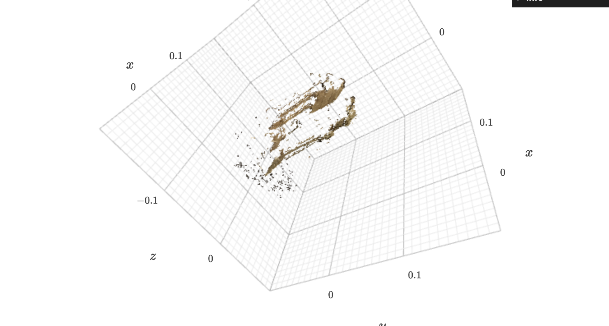
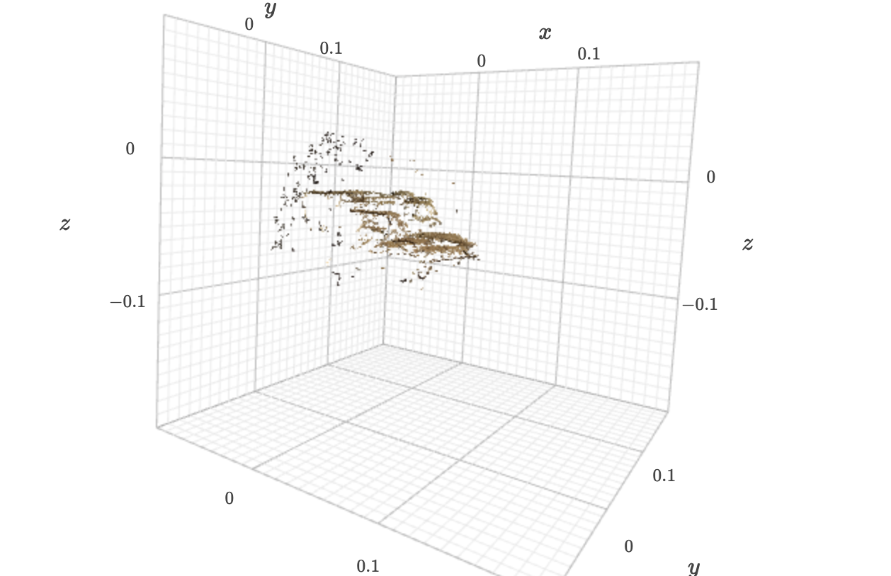
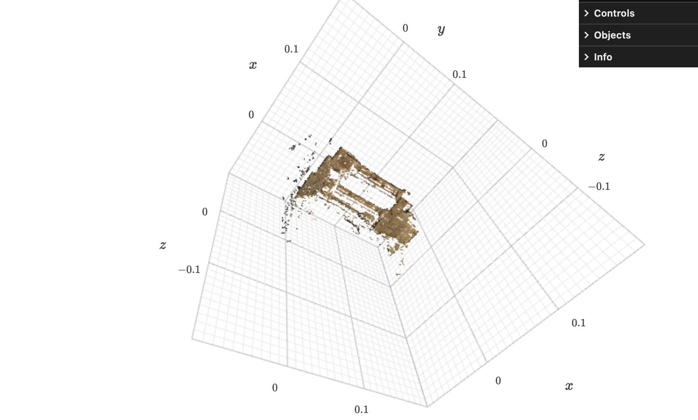
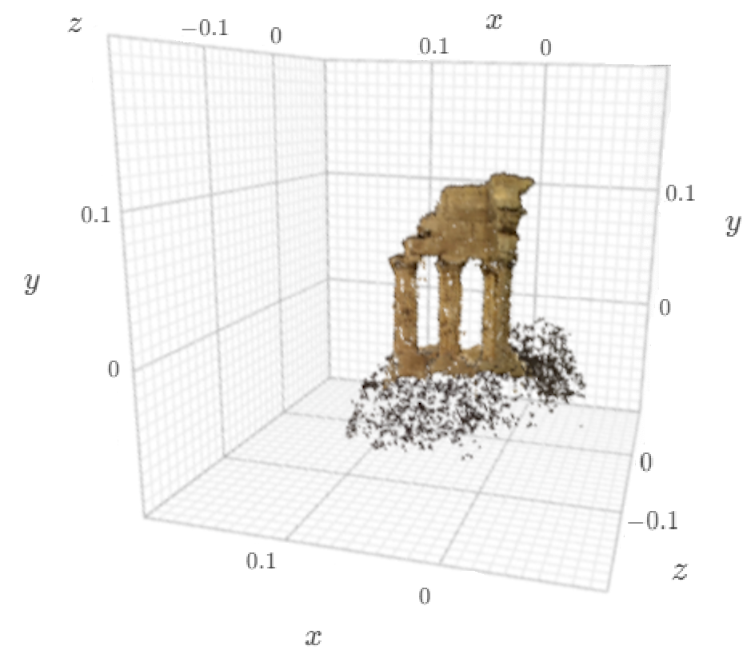
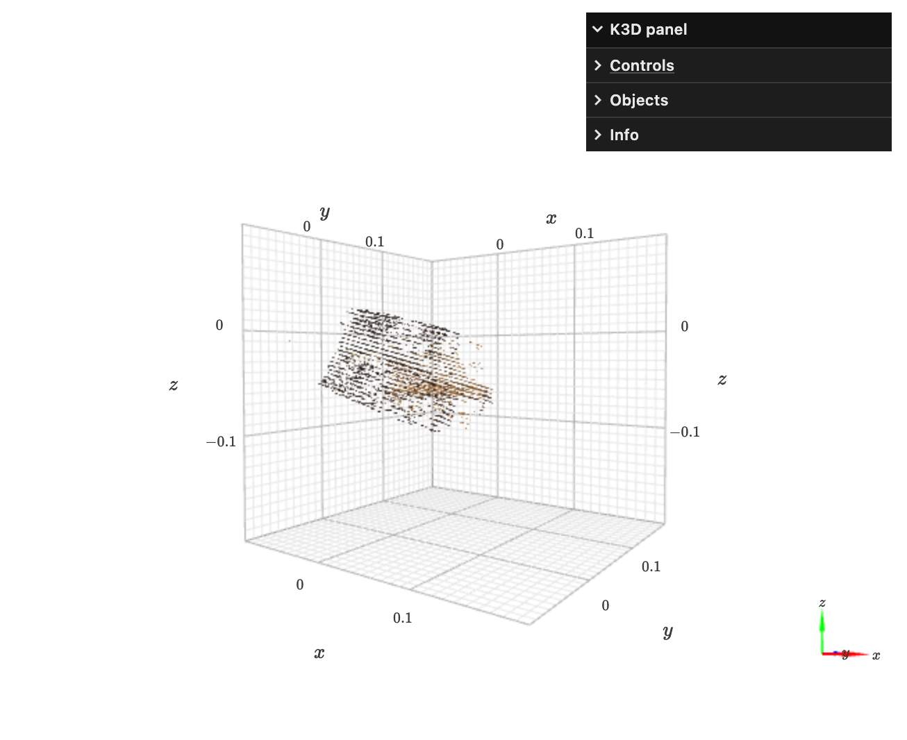

# Penn-CIS580
This is my CIS580 (Machine Perception) final project in 2022 spring.

This project implements two-view stereo and multi-view (plane-sweep) stereo algorithms to convert multiple 2D viewpoints into a 3D reconstruction of the scene.

Screenshots of visualizations using K3D library are shown below.

## [1. Two View Stereo](https://github.com/yichengxia/Penn-CIS580/blob/main/two_view.ipynb)
(a) Reconstruction using SSD kernel

(b) Reconstruction using SAD kernel

(c) Reconstruction using ZNCC kernel

(d) Multi-pair aggregation

## [2. Plane-Sweep Stereo](https://github.com/yichengxia/Penn-CIS580/blob/main/plane_sweep.ipynb)

